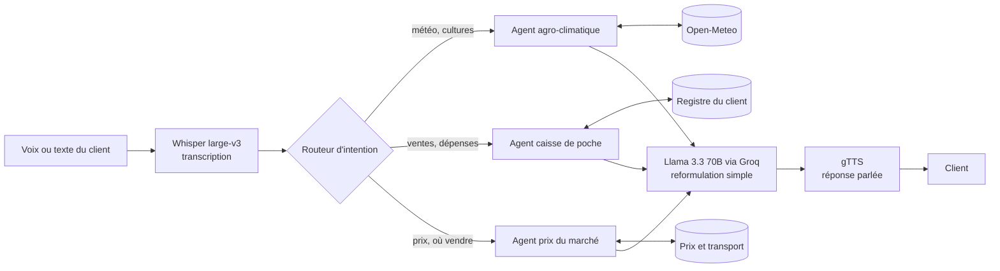

<div align="center">

# Conseiller Agricole Virtuel MC2
### Agent d'accompagnement économique pour les clients des Mutuelles Communautaires de Croissance


**[Tester la démo en ligne en cliquant ici !](https://mc2-conseiller-hcflcbpvrwlalqymtwacck.streamlit.app/)**

*Projet conçu et développé par **Romuald MBANA MEDJO** dans le cadre de l'entretien chez la SAPA (Société Africaine de Participation).*

</div>

> **Note** : l'application de démonstration s'endort après quelques jours d'inactivité. Si la page affiche « Wake up », cliquez sur le bouton et patientez environ 30 secondes.

---

## 1. Le problème

Financer ne suffit pas : pour réduire durablement la pauvreté, il faut que les projets financés réussissent. Or les agents de crédit des MC2 ont rarement le temps de former et de suivre chaque agriculteur ou commerçant sur le terrain. Un client isolé face à une sécheresse, une chute des prix ou une comptabilité approximative peut voir son projet échouer et sa capacité de remboursement s'effondrer.

## 2. La solution

Un **conseiller virtuel accessible par la voix**, conçu pour le smartphone, qui accompagne le client au quotidien à trois niveaux :

| Agent | Mission | Sources de données |
|---|---|---|
| **Alerte agro-climatique** | Lit les prévisions à 5 jours à l'emplacement de la parcelle financée et envoie une alerte personnalisée : irrigation, risque de mildiou, moment pour épandre l'engrais. | API Open-Meteo (sans clé) |
| **Caisse de poche** | Enregistre les ventes et dépenses dictées à la voix (« J'ai vendu 3 sacs de maïs à 25 000 francs ») et tient le solde à jour. | Dictée du client, extraction JSON par le LLM |
| **Prix du marché** | Compare les marchés voisins, déduit le coût de transport, et indique où vendre et s'il vaut mieux vendre maintenant ou attendre. | Prix hebdomadaires (simulés en démo) |

Un **routeur d'intention** reçoit chaque message vocal ou écrit et le confie à l'agent adapté. Chaque réponse est courte, en mots simples, et peut être écoutée.

### Architecture



Principe de conception : les **calculs** (risques agronomiques, prix net après transport, solde) sont **déterministes** dans le code. Le LLM sert à extraire, reformuler et traduire en langage simple, pas à inventer les chiffres. Sans clé API, l'application bascule sur des réponses par règles : la démo ne plante jamais.

## 3. Avantages

- **Accessible** : l'usage se fait à la voix, sans avoir à savoir lire ou taper. Cela convient à un public rural.
- **Proactif** : l'alerte météo arrive avant le problème, pas après.
- **Utile au portefeuille** : un client mieux accompagné réussit davantage, ce qui protège la MC2 (risque de crédit) et le client (revenus).
- **Donne un historique financier** : la caisse de poche produit des données de trésorerie fiables, précieuses pour évaluer un futur crédit.
- **Décision chiffrée** : le conseil de vente s'appuie sur le prix net après transport, pas sur une intuition.
- **Léger et peu coûteux** : aucun modèle local, aucune base lourde ; l'inférence est déléguée à Groq (gratuit pour un prototype).
- **Portable** : un seul `docker compose up` suffit à le lancer n'importe où.
- **Passe à l'échelle de l'agent de crédit** : un conseiller virtuel peut suivre des milliers de clients simultanément, là où un agent en suit quelques dizaines.

## 4. Limites (à connaître)

- **Langues locales** : Whisper et les voix synthétiques grand public ne couvrent pas correctement le fufuldé, l'ewondo ni le ghomala. Le prototype fonctionne pleinement en **français et en anglais** ; les langues locales sont en **bêta** (le modèle tente une réponse écrite, la voix reste en français).
- **Données simulées** : le portefeuille de clients, les marchés et les prix sont fictifs (`data.py`). Ils doivent être remplacés par les relevés réels de la MC2.
- **Pas de canal WhatsApp** : la démo est une application web ; l'intégration WhatsApp Business n'est pas réalisée.
- **Dépendance à Internet** : la transcription, le LLM, la météo et la voix nécessitent une connexion. Les zones à faible couverture sont un frein réel.
- **Dépendance à des services tiers** : Groq, Open-Meteo et Google (gTTS) peuvent changer leurs conditions ou limites gratuites.
- **Extraction imparfaite** : une dictée ambiguë (« 3 sacs à 25 000 » : le prix est-il unitaire ou total ?) peut être mal interprétée. Une confirmation avant enregistrement serait nécessaire en production.
- **Conseils agronomiques génériques** : les règles météo/culture sont simples ; elles ne remplacent pas un agronome et ne tiennent pas compte du sol, de la variété ni du stade de culture.
- **Confidentialité** : la production exigerait un cadre de protection des données personnelles et financières des clients (consentement, hébergement, chiffrement).

## 5. Perspectives

1. **Langues locales natives** : partenariats avec des acteurs de données linguistiques africains (communautés type Masakhane, jeux de données de parole) pour la reconnaissance et la synthèse en fufuldé, ewondo, ghomala.
2. **Canal WhatsApp** : passage par l'API WhatsApp Business pour toucher les clients là où ils sont déjà, avec messages vocaux entrants et sortants.
3. **Mode hors-ligne / USSD / SMS** : alertes courtes pour les zones sans données mobiles.
4. **Données réelles** : connexion aux relevés de prix des marchés, aux données de la MC2 (parcelles, montants, échéances) et à des sources agronomiques locales.
5. **Tableau de bord pour l'agent de crédit** : vue portefeuille avec les clients à risque (alertes ignorées, trésorerie en baisse) pour concentrer les visites terrain là où elles comptent.
6. **Scoring de crédit alternatif** : exploiter l'historique de la caisse de poche pour évaluer des clients sans dossier bancaire.
7. **Mesure d'impact** : suivre des indicateurs (taux de remboursement, revenu par hectare, pertes évitées) pour démontrer le retour social, en cohérence avec l'approche d'*impact investing*.
8. **Orchestration multi-agents avancée** : passage à CrewAI ou LangGraph pour des scénarios où les agents collaborent (ex. : alerte climatique qui déclenche un conseil de vente anticipée).

## 6. Installation

### Option A : Docker (recommandée)

Prérequis : [Docker](https://docs.docker.com/get-docker/) et une clé gratuite sur [console.groq.com](https://console.groq.com).

```bash
git clone https://github.com/VOTRE_PSEUDO/mc2-conseiller.git
cd mc2-conseiller
cp .env.example .env        # puis éditer .env et renseigner GROQ_API_KEY
docker compose up --build
```

Ouvrir **http://localhost:8501**. Pour arrêter : `docker compose down`.

### Option B : Python en local

Prérequis : Python 3.12.

```bash
git clone https://github.com/VOTRE_PSEUDO/mc2-conseiller.git
cd mc2-conseiller
python -m venv .venv
source .venv/bin/activate          # Windows : .venv\Scripts\activate
pip install -r requirements.txt
export GROQ_API_KEY="gsk_..."      # Windows PowerShell : $env:GROQ_API_KEY="gsk_..."
streamlit run app.py
```

### Option C : Déploiement sur Streamlit Community Cloud

1. Publier le dépôt sur GitHub (sans le fichier `.env`).
2. Sur [share.streamlit.io](https://share.streamlit.io), **Create app**, choisir le dépôt, la branche `main` et le fichier `app.py`.
3. Dans **Advanced settings > Secrets**, ajouter :
   ```toml
   GROQ_API_KEY = "gsk_votre_cle_ici"
   ```
4. Cliquer sur **Deploy**.

### Variables de configuration

| Variable | Rôle | Obligatoire |
|---|---|---|
| `GROQ_API_KEY` | Accès au LLM et à Whisper | Non (mode secours sans voix entrante ni LLM) |

## 7. Guide d'utilisation

1. **Choisir un client MC2** dans la liste (chaque profil a sa culture et sa localisation), puis la **langue**.
2. **Onglet Parler** : appuyer sur le micro, dire la phrase, arrêter l'enregistrement. L'agent répond par écrit et à voix haute. Un champ texte est disponible en secours.
3. **Onglet Météo** : « Générer l'alerte du jour » affiche l'alerte, le tableau des prévisions sur 5 jours et sa version audio.
4. **Onglet Caisse** : dicter ou écrire une opération ; les ventes, dépenses et le solde se mettent à jour.
5. **Onglet Marché** : « Où et quand vendre ? » classe les marchés par prix net après transport et trace l'évolution des prix.

### Scénario de démonstration (3 minutes)

| Étape | Action | Ce qu'on montre |
|---|---|---|
| 1 | Sélectionner *Jean-Paul K. · Bafoussam · Tomates* | Le suivi est personnalisé par culture et par lieu |
| 2 | Onglet Parler : « Est-ce que je dois traiter mes tomates cette semaine ? » | Le routeur choisit l'agent climat, la réponse est parlée |
| 3 | Dire : « J'ai vendu 3 sacs de tomates à 25 000 francs » | La dictée devient une écriture comptable et le solde bouge |
| 4 | Onglet Marché : « Où et quand vendre ? » | Le prix net après transport guide la décision |
| 5 | Conclure | Un agent de crédit suit ainsi des milliers de clients |

## 8. Structure du projet

```
mc2-conseiller/
├── app.py               # Interface Streamlit (design, onglets, voix)
├── agents.py            # Agents climat / finance / marché + routeur + Whisper
├── data.py              # Données simulées : clients, marchés, prix, transport
├── requirements.txt     # Dépendances Python
├── Dockerfile           # Image de l'application
├── docker-compose.yml   # Lancement en une commande
├── .streamlit/config.toml  # Thème
├── .env.example         # Modèle de configuration (ne jamais versionner .env)
└── README.md
```

## 9. Dépannage

| Problème | Cause probable | Solution |
|---|---|---|
| « Voix non reconnue » | Clé Groq absente ou invalide | Vérifier `GROQ_API_KEY` ; utiliser le champ texte en attendant |
| Le micro ne s'active pas | Autorisation refusée ou page en HTTP | Autoriser le micro dans le navigateur ; utiliser `localhost` ou HTTPS |
| Pas de réponse audio | Service gTTS injoignable | Vérifier la connexion Internet ; la réponse écrite reste affichée |
| Prévisions identiques à chaque fois | Open-Meteo injoignable, données de secours utilisées | Vérifier la connexion |
| Port 8501 déjà utilisé | Une autre instance tourne | Changer le port dans `docker-compose.yml` (`"8502:8501"`) |

## 10. Avertissement

Ce projet est un **prototype de démonstration**. Les données de clients, de prix et de marchés sont fictives, et les conseils produits ne remplacent ni un agronome ni un conseiller financier.

---

<div align="center">

Conçu et développé par **Romuald MBANA MEDJO**

</div>
